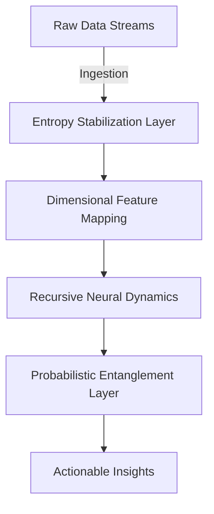

      ▄███████████████████████████████████▄
     ███████████████████████████████████████
    ███▀      ▄▄▄▄     ▄▄▄▄▄▄      ▀████████
   ███    ▄█████████ ██████████▄    ████████
  ████   ███▀▀▀▀▀▀▀ ▀▀▀▀▀▀▀▀███   █████████
  █████  ███ ▄█████▄ ██████▄ ███  ██████████
   █████▄███ ███████ ███████ ███▄███████████
    ████████ ▀█████▀ ▀█████▀ ██████████████
     █████████▄  ▀▀▀   ▀▀▀  ▄██████████████
      ████████████████████████████████████
       ▀███████████████████████████████▀

QUANT AI: WHITEPAPER V1.0

INITIALIZING CONCEPTUAL ARCHITECTURE...
[█░░░░░░░░░░░░░░░░░░░░░░░░░░░░░] 12%
DEPLOYING NEURAL RECURSION MODELS...
[█████░░░░░░░░░░░░░░░░░░░░░░░░] 37%
INTEGRATING PROBABILISTIC DIMENSIONS...
[█████████░░░░░░░░░░░░░░░░░░░░] 54%
OPTIMIZING QUANTUM ENTANGLEMENT...
[███████████████░░░░░░░░░░░░░░] 78%
SYSTEM FULLY OPERATIONAL.
[█████████████████████████████] 100%
```

# Quantum AI: Whitepaper

## Abstract

Quantum AI (QAI) redefines the boundaries of artificial intelligence through self-adaptive learning models and quantum-integrated processing units. Designed for maximum autonomy, QAI utilizes recursive neural dynamics, probabilistic entanglement, and dimensional feature mapping to interpret, adapt, and evolve within complex data ecosystems.

---

## System Architecture

### 1. Recursive Neural Dynamics (RND)
A multi-layered neural substrate designed for perpetual optimization. RND cycles data through fractalized learning loops, enabling hyper-contextual decision-making within fluctuating parameters.

- **Fractalized Feedback Nodes (FFN):** Recursive nodes that amplify critical signal pathways.
- **Entropy Stabilization Layer (ESL):** Balances chaotic data inputs to prevent destabilization.

### 2. Probabilistic Entanglement Layer (PEL)
The PEL processes quantum-coherent data streams, employing Bayesian stochasticity to enhance prediction accuracy.

- **Quantum Noise Filtering (QNF):** Isolates actionable signals from probabilistic noise.
- **State Collapse Analytics (SCA):** Models data uncertainty within multidimensional probability fields.

### 3. Dimensional Feature Mapping (DFM)
Utilizes hyper-dimensional spaces to classify and interpolate unstructured data into actionable outputs.

- **Dimensional Fold Operators (DFO):** Compresses high-variance data into operable dimensions.
- **Latent Feature Extrapolation (LFE):** Discovers hidden correlations within sparse datasets.

---

## Core Innovations

1. **Hyper-Adaptive Learning:**
   QAI evolves through continuous meta-optimization cycles, aligning models to dynamic data patterns.

2. **Temporal Entanglement Protocols:**
   Integrates temporal data streams to construct predictive models of future-state scenarios.

3. **Synthetic Dimensional Bridging:**
   Builds cross-dimensional interaction matrices for enhanced context recognition.

---

## Implementation Framework

### Input Pipeline



### System Code Example

```python
from quantum_ai import QuantumEngine

# Initialize Quantum AI Engine
qai = QuantumEngine(config="default")

# Ingest raw data
data = qai.ingest("https://datastream.example.com")

# Process data through neural dynamics
processed = qai.process(data, method="RND")

# Generate probabilistic insights
insights = qai.analyze(processed, layer="PEL")

print(insights)
```

---

## Use Cases

1. **Autonomous Data Interpretation:** Extracting latent insights from chaotic environments.
2. **Predictive Analytics:** Forecasting trends through high-precision probabilistic modeling.
3. **Dynamic Ecosystem Adaptation:** Real-time adjustment to evolving data ecosystems.

---

## Disclaimer

This whitepaper presents conceptual and experimental designs. Implementation requires expert oversight, and deployment is subject to compliance with regional regulations and ethical guidelines.

---

## Future Directions

- **Quantum Neural Fusion:** Integration of symbolic reasoning within quantum-optimized neural substrates.
- **Holographic Prediction Models:** Leveraging 5D data mappings for ultra-high-resolution forecasting.
- **Distributed AI Networks:** Decentralized architectures for global scalability.
